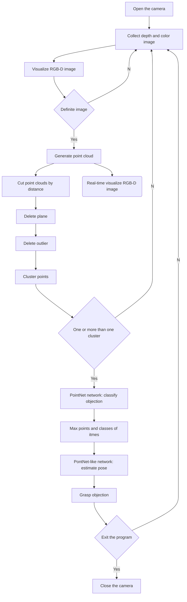

# PointNet-Like-Pose-Estimation

This is a Final Year Project (FYP) in of School of Advanced Technology of Xi'an Jiaotong-Liverpool University. This FYP tried to realize the object pose estimation for robot grasping based on the point cloud. Therefore, we applied the PointNet network, which is an end-to-end framework, to the basis of our work.

As the time and hardware limitations, we only designed and trained our PointNet network and PoinetNet-like network, and given the Python functions that were used to realize point cloud collection and pre-procession, but not design the program that realizes the total process includes point cloud collection, point cloud pre-procession, objection classification, object pose estimation, and robot grasping. However, the flowchart for this program is shown as

