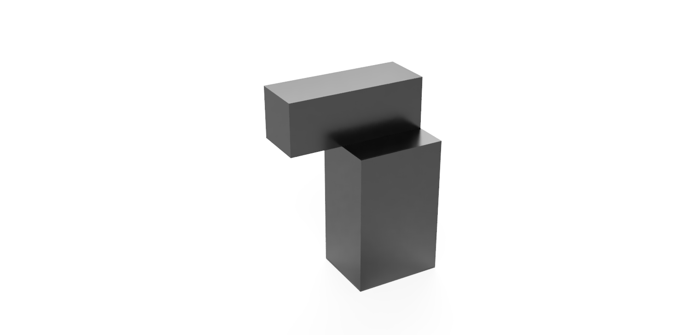
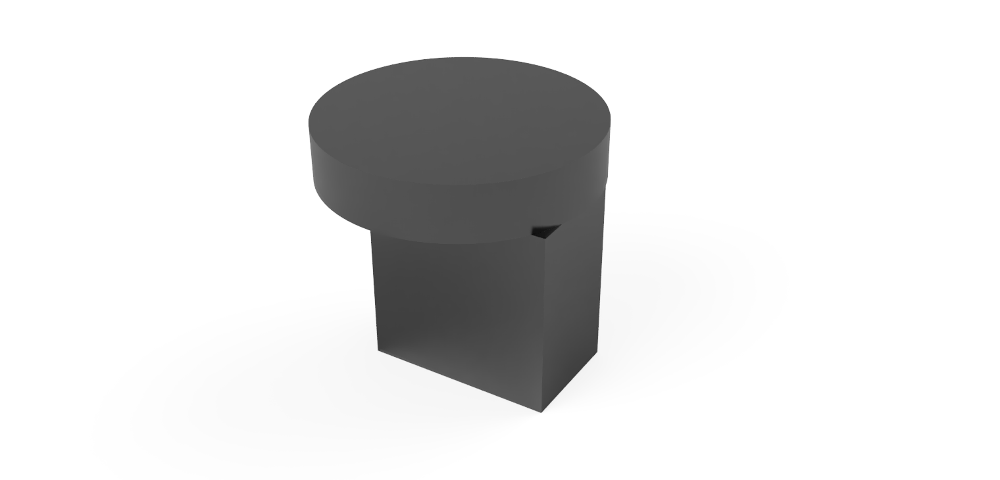
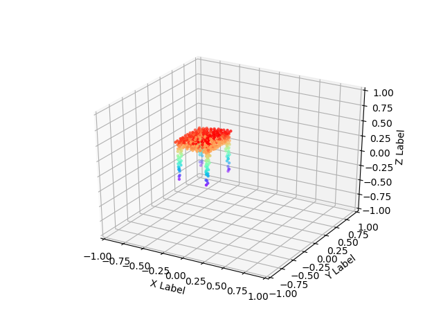
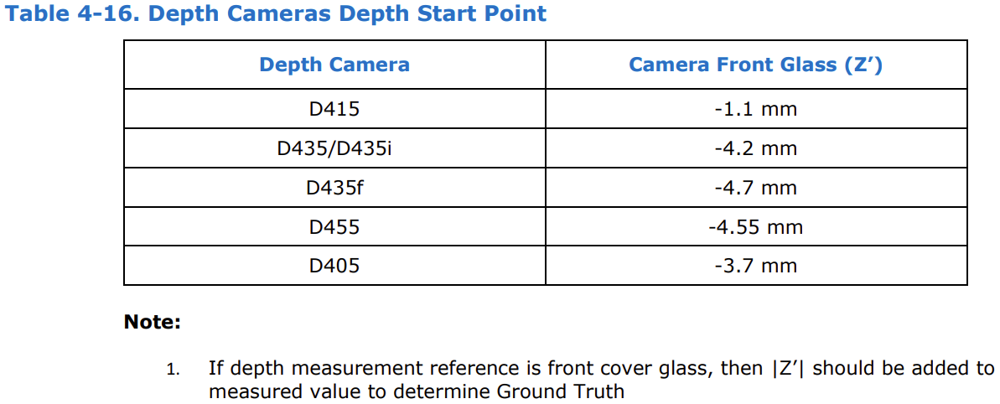
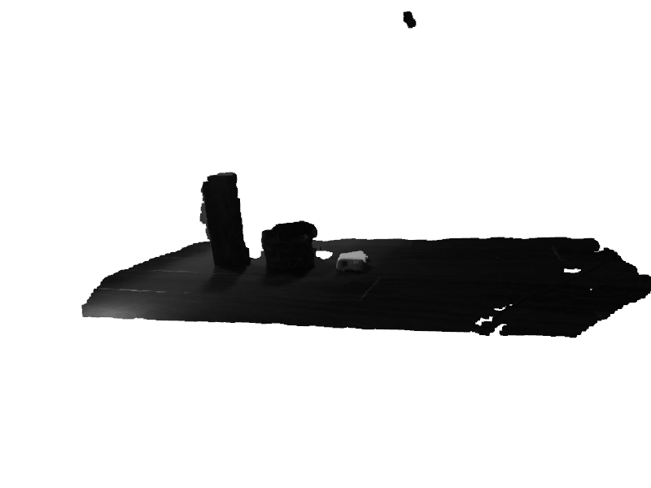
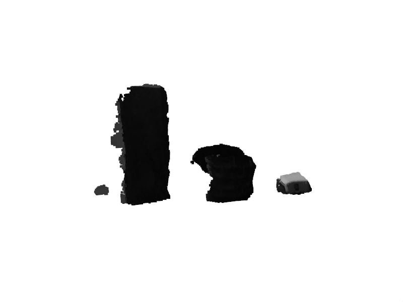

# PointNet-like-Pose-Estimation

## 网络

首先搭建pointnet

pointnet的网络，输入为$N \times 3$或$N \times 6$的矩阵，转置在网络中完成

只需要pointnet中classification和semantic segmentation网络

~~采集得到的点云数据，首先通过semantic segmentation将物体从工作台中分割出来，后进行分类~~


==是否要增加一个网络去判断抓取物体的宽度？这个网络是否需要feature transform？==

### translation，rotation和width网络

`L2-loss`
$$
\text{Loss}(y, \text{pred})=\sum (y-\text{pred})^2
$$

```python
import torch
def lossTest():
    input=torch.randn(3,5,requires_grad=True)
    target=torch.randn(3,5)
    mae_loss=torch.nn.MSELoss()
    output=mae_loss(input,target)
    output.backward()
    print(input.grad)    #grad
 
if __name__=="__main__":
    lossTest()
```

使用平方意味着当预测值离目标值更远时在平方后具有更大的惩罚，预测值离目标值更近时在平方后惩罚更小，因此，当异常值与样本平均值相差格外大时，模型会因此惩罚更大而开始偏离，相比之下，L1对异常值的鲁棒性更好。因此可以考虑是否使用`L1-loss`
$$
\text{Loss}(y, \text{pred})=\sum |y-\text{pred}|
$$

```python
import torch
def lossTest():
    input=torch.randn(3,5,requires_grad=True)
    target=torch.randn(3,5)
    mae_loss=torch.nn.L1Loss()
    output=mae_loss(input,target)
    output.backward()
    print(input.grad)    #grad
 
if __name__=="__main__":
    lossTest()
```

默认使用`L1-loss`,但在构`get_loss()`函数的时候增加`L2=False`变量，当`L2=True`时，则使用`L2-loss`

### sign网络

由于该网络需要返回具体的$-1$或$1$，所以该网络设定为分类网络且结果为一个二维向量$\text{target} = [1,\ 0]$或$\text{target} = [0,\ 1]$，且`choice = pred.data.max(1)[1]`且pred结果为0或1。

由于最后的sign可以表示为$\text{sign}=(-1)^\text{choice}$。因此，$\text{target} = [1,\ 0]$表示sign为1，$\text{target} = [0,\ 1]$表示sign为0

由于当x的输入特别大时，Softmax存在上溢现象，所以使用LogSoftmax

而对于损失函数，当先前使用了LogSoftmax，则损失函数应该为nll loss

```python
input = torch.randn(3, 5, requires_grad=True)
# each element in target has to have 0 <= value < C
target = torch.tensor([1, 0, 4])
print('input:{}\n target:{}'.format(input,target))
print('log softmax:{}'.format(F.log_softmax(input,dim=1)))
output = F.nll_loss(F.log_softmax(input,dim=1), target)
print('output:{}'.format(output))
output.backward()
```

[Softmax和LogSoftmax](https://zhuanlan.zhihu.com/p/570141358)

由于sign网络只有两个选择，是否要使用 `BCELoss()`。如果使用的话则需要使用sigmoid函数，且设定0.5为阈值
$$
L = -(1-y)\log(1-x) - y\log(x)
$$


```
m = nn.Sigmoid()
loss = nn.BCELoss()
input = torch.randn(3, requires_grad=True)
target = torch.empty(3).random_(2)
output = loss(m(input), target)
```

当使用sigmoid函数时，只存在$\text{output} \in (0,1)$且有
$$
\text{sign} = 
\begin{cases}
	-1 & \text{output} \le 0.5 \\
	1 & \text{output} > 0.5
\end{cases}
$$
则sign网络的返回值为$(0,1)$的x和sign

~~PointSimGrasp网络需要将class vector和point cloud set拼接，但如果拼接的不是class vector而是点的gobal feature？~~

==如果三个pointnet-like network都使用一样的网络结果，即均和pointnet-like network 3类似，是否能提升效果？但这样的话计算成本会极大的增加，是否要改用pointnet++？==

**是否所有网络都需要增加input transform和feature transform？**

`model/pose.py`将point transform，feature fransform合并，通过不同设置可以实现不同网络

```python
class get_model(nn.Module):
    def __init__(self, mlp_list, linear_list, mean=False, classify=False, num_category=5, normal_channel=True, transform=False, feat_trans=False):
```

==数据进入`pointnet-like`网络前是否需要normalization==

在对数据做normalizat处理之前，先计算该组数据的mean并保存。mean后面将用于translation网络。若先做normalization处理再计算mean，则mean值始终为0。

## 实验结果

| Model        | --log_dir                      | Instance Accuracy / Loss |
| ------------ | ------------------------------ | ------------------------ |
| pointnet_cls | pointnet_cls                   | 0.996575                 |
| sign         | sign                           | 0.818921                 |
| rotation     | rotation_l1_mean               | 4.748724                 |
| rotation     | rotation_l1_sum                | 4.753969                 |
| rotation     | rotation (l2_mean, default)    | 4.921530                 |
| rotation     | rotation_l2_sum                | 5.292929                 |
| translation  | translation_l1_mean            | 1.455615                 |
| translation  | translation_l1_sum             | 1.328656                 |
| translation  | translation (l2_mean, default) | 1.412712                 |
| translation  | translation_l2_sum             | 1.471577                 |
| translation  | translation_l1_mean_no_mlp     | 1.376456                 |
| translation  | translation_l1_sum_no_mlp      | 1.313197                 |
| translation  | translation_no_mean_mlp        | 1.427001                 |
| translation  | translation_l2_sum_no_mlp      | 1.300314                 |

在大部分计算中, 损失函数为`L1`且loss reduction为sum的时候效果最好

| Model            | --log_dir                          | Instance Accuracy / Loss |
| ---------------- | ---------------------------------- | ------------------------ |
| pointnet_cls_ssg | pointnet_cls_ssg                   | 0.998074                 |
| pointnet_cls_msg | pointnet_cls_msg                   |                          |
| sign_ssg         | sign_ssg                           |                          |
| sign_msg         | sign_msg                           |                          |
| rotation_ssg     | rotation_ssg_l1_mean               | 3.705541                 |
| rotation_msg     | rotation_msg_l1_mean               |                          |
| rotation_ssg     | rotation_ssg_l1_sum                |                          |
| rotation_msg     | rotation_msg_l1_sum                |                          |
| rotation_ssg     | rotation_ssg (l2_mean, default)    |                          |
| rotation_msg     | rotation_msg (l2_mean, default)    |                          |
| rotation_ssg     | rotation_ssg_l2_sum                |                          |
| rotation_msg     | rotation_msg_l2_sum                |                          |
| translation_ssg  | translation_ssg_l1_mean            |                          |
| translation_msg  | translation_msg_l1_mean            |                          |
| translation_ssg  | translation_ssg_l1_sum             | 0.012810                 |
| translation_msg  | translation_msg_l1_sum             | 0.014115                 |
| translation_ssg  | translation_ssg (l2_mean, default) |                          |
| translation_msg  | translation_msg (l2_mean, default) |                          |
| translation_ssg  | translation_ssg_l2_sum             |                          |
| translation_msg  | translation_msg_l2_sum             |                          |
| translation_ssg  | translation_ssg_l1_mean_no_mlp     | 0.013123                 |
| translation_msg  | translation_msg_l1_mean_no_mlp     |                          |
| translation_ssg  | translation_ssg_l1_sum_no_mlp      |                          |
| translation_msg  | translation_msg_l1_sum_no_mlp      | 0.014197                 |
| translation_ssg  | translation_ssg_no_mean_mlp        |                          |
| translation_msg  | translation_msg_no_mean_mlp        |                          |
| translation_ssg  | translation_ssg_l2_sum_no_mlp      |                          |
| translation_msg  | translation_msg_l2_sum_no_mlp      |                          |


## 数据集制作

单位均使用米

## 形状

立方体

圆柱体

不同立方体之间的组合

立方体和圆柱体的组合

H型


物体通过fusion 360做出.stl或.obj格式三维模型







导入[BlenSor](https://www.blensor.org/)中模拟tof或其他深度相机采集得到数据

BlenSor提供了python接口，可以通过脚本形式快速采集

[CloudCompare](https://www.cloudcompare.org/)可用于点云每个点的标签制作，此软件用于制作训练semantic segmentation的训练集

在制作基本模型$D=(x,y,z)$的时候，要求$\text{min}(z)=0$且$x=0$以及$y=0$，而对于质量均匀分布的物体，质心的z轴位置可大致认为是$\frac{1}{2}\text{max}(z)$

默认所有物体为水平放置，且没有旋转，即在欧拉角中，即$\psi, \theta, \phi =0^{\circ}$，此时物体的transformation matrix为
$$
T = \begin{bmatrix}
       1 & 0 & 0 & 0 \\
       0 & 1 & 0 & 0 \\
       0 & 0 & 1 & \frac{1}{2}z_{max} \\
       0 & 0 & 0 & 1
    \end{bmatrix}
$$
[Dex-Net 2.0](https://berkeleyautomation.github.io/dex-net/)网络公布了其用于训练的数据集。该数据集包含670万个点云、抓取和分析抓取指标，且由Dex-Net 1.0的数千个3D模型以随机姿势生成的

### 模型

#### cube

$\text{size} \in (5,10)$

`random.randint(5,10)`

$(\phi, \theta, \psi) \in (-45^\circ, 45^\circ)$

`random.randint(-45,45)`

$p_x \in (-0.5,0.5)$

`random.randint(-5,5) / 10`

$p_y \in (-0.5,0.5)$

`random.randint(-5,5) / 10`

$p_z \in (-1,-0.6)$

`random.randint(-10,-6) / 10`

#### cuboid

$\text{length}  \in (3,5)$

$\text{width} \in (6,10)$

$\text{height} \in (4,8)$

$\phi \in (-90^\circ, 90^\circ)$

$(\theta, \psi) \in (-45^\circ, 45^\circ)$

$p_x \in (-0.5,0.5)$

$p_y \in (-0.5,0.5)$

$p_z \in (-1,-0.6)$

#### cylinder

$\text{radius} \in (2,4)$

$\text{height} \in (4,8)$

$\phi = 0^\circ$

$(\theta, \psi) \in (-45^\circ, 45^\circ)$

$p_x \in (-0.5,0.5)$

$p_y \in (-0.5,0.5)$

$p_z \in (-1,-0.6)$

#### h_structure

$H, B \in (8,10)$

$t_1, t_2 \in (1,3)$

$\phi \in (-90^\circ, 90^\circ)$

$(\theta, \psi) \in (-45^\circ, 45^\circ)$

$p_x \in (-0.5,0.5)$

$p_y \in (-0.5,0.5)$

$p_z \in (-1,-0.6)$

#### double_cube

$\text{size}_1 = (3,8,5), (4,6,8), (2,7,3)$

$\text{size}_2 = (8,10,8), (7,9,9),(10,7,9)$

$\phi \in (-90^\circ, 90^\circ)$

$(\theta, \psi) \in (-45^\circ, 45^\circ)$

$p_x \in (-0.5,0.5)$

$p_y \in (-0.5,0.5)$

$p_z \in (-1,-0.6)$

#### double_cylinder

$\text{size}_1 = (2,7), (3,6)$

$\text{size}_2 = (4,8), (5,10)$

$\phi \in (-90^\circ, 90^\circ)$

$(\theta, \psi) \in (-45^\circ, 45^\circ)$

$p_x \in (-0.5,0.5)$

$p_y \in (-0.5,0.5)$

$p_z \in (-1,-0.6)$

#### cube_cylinder

$\text{size}_1 = (2,7), (3,6)$

$\text{size}_2 = (8,10,8), (7,9,9)$

$\phi \in (-90^\circ, 90^\circ)$

$(\theta, \psi) \in (-45^\circ, 45^\circ)$

$p_x \in (-0.5,0.5)$

$p_y \in (-0.5,0.5)$

$p_z \in (-1,-0.6)$

每种物体随机采集8000次

### Semantic Segmentation数据集

通过制作基本模型，并标记上所有点属于某一类型，例如立方体

再准备用于模拟workbench的模型$Q=(x',y',z')$且有$\text{max}(x')=0$，并标记该点属于workbench

此时物体与workbench均为水平放置，

再组合$D$和$Q$point cloud set之前，首先对$D$进行位置操作，加上translation matrix，即
$$
D'= \begin{bmatrix}
       1 & 0 & 0 & \Delta x \\
       0 & 1 & 0 & \Delta y \\
       0 & 0 & 1 & \Delta z\\
       0 & 0 & 0 & 1
    \end{bmatrix} D
$$
后直接将两个point cloud set合并到一个文件里面。最后乘上rotation matrix $R$

==**通过数学方式实现，不需要制作数据集**==

## 数据集扩展

对于任意一个point cloud数据集$D=(x, y, z)$来说，如果想改变这个物体的大小，有$D'=(\alpha x, \beta y, \gamma z)$，便可以通过一个物体的模型得到多个类似但大小不同的模型。再通过随机的transformation matrix，可以得到不同位置和角度的数据集。同时要求记录下每个transformation matrix的数据，并用于pointnet-like网络的训练

但摄像机所拍摄的点云只有一个面，与制作的数据集情况不符。是否要通过实际拍摄或软件模拟的方式重新制作数据集。

[使用PCL从CAD模型中提取不同视角下的点云](https://blog.csdn.net/jiangxing11/article/details/106218168?spm=1001.2101.3001.6650.8&utm_medium=distribute.pc_relevant.none-task-blog-2%7Edefault%7EBlogCommendFromBaidu%7ERate-8-106218168-blog-56489574.pc_relevant_aa2&depth_1-utm_source=distribute.pc_relevant.none-task-blog-2%7Edefault%7EBlogCommendFromBaidu%7ERate-8-106218168-blog-56489574.pc_relevant_aa2&utm_relevant_index=9)

[基于pcl从CAD模型中获取单视角点云](https://blog.csdn.net/irobot2016/article/details/56489574?locationNum=9&fps=1)

## 点云处理

可以使用`open3d`库来做点云处理

`open3d`库中有大量包括旋转，缩放，移动，离散点去除在内的多种点云处理函数，但所有数组需要先转化到`pcd`或`ply`格式才能使用

```python
points = np.random.randn((10,3))

ply = o3d.geometry.TriangleMesh()
ply.vertices = o3d.utility.Vector3dVector(points)

pcd = open3d.geometry.PointCloud()
pcd.points = open3d.utility.Vector3dVector(point_cloud)
```

但`transformer.py`和`provider.py`中使用的是`pcd`格式，但输入为`array`格式，所以后面realsense所成图像也尽量使用此格式或直接转化成`array`格式

由于要处理数据集，`transformer.py`里面也包含了使用`array`格式对点云处理的

[三维点云](https://blog.csdn.net/suiyingy/category_11740467_2.html)

[三维点云论文](https://blog.csdn.net/weixin_44751294/category_12056030.html)

[三维点云实践](https://blog.csdn.net/weixin_44751294/category_12056027.html)

[Python点云显示：open3d快速上手](https://blog.csdn.net/m0_37816922/article/details/126896359)

[open3d 和numpy 交互](https://blog.csdn.net/weixin_39849839/article/details/122371294)

[Open3d学习计划](https://blog.csdn.net/io569417668?type=blog)

### 语义分割

~~如果存在物体重叠且为相同物体重叠，则输出中两个相同物体会被归为一类，无法做到分割。但是否能形成只有未被遮挡的物体位姿可以判断而被遮挡物体无法计算，从而实现只抓住一个物体的效果。~~

~~pointnet和pointnet++已经训练好的模型是不是可以直接拿来用?~~

**但如果使用的都不是现实的物体而是类似于红色的立方体的物体，便可以直接通过现在做分割，再用open3d库里面的函数做离群点去除**

首先通过离群点去除处理掉远处的点，才通过平面拟合找到属于工作台的点后去除相关点，留下的便是只属于物体的点

如果有多个物体且物体之前不重合，使用DBSCAN聚类算法实现物体聚类

### RANSAC算法

==它是根据一组包含异常数据的样本数据集，计算出数据的数学模型参数，得到有效样本数据的算法==

不同于最小二乘法需要将所有点代入计算，RANSAC只将部分点代入计算，因此对有噪声的数据集有更好的拟合效果

**在实际点云采集中，唯一的干扰就是工作台，所以只要将工作台去除便可以实现对物体的提取，而RANSAC算法可以找出point cloud set中的平面**

[RANSAC介绍（Matlab版直线拟合+平面拟合）](https://blog.csdn.net/u010128736/article/details/53422070?spm=1001.2101.3001.6650.10&utm_medium=distribute.pc_relevant.none-task-blog-2~default~LandingCtr~Rate-10.queryctrv4&depth_1-utm_source=distribute.pc_relevant.none-task-blog-2~default~LandingCtr~Rate-10.queryctrv4&utm_relevant_index=14)

[RANSAC点云多平面拟合分割](https://blog.csdn.net/Subtlechange/article/details/123004329)

[RANSAC分割平面 open3d](https://blog.csdn.net/suiyingy/article/details/124532740)

假定处于一二维平面且需要拟合一条直线。首先假定模型$y=ax+b$，从数据集中抽取$n$个点，并进行数据拟合获得第一个方程。由于不是严格线性，数据点存在波动$\sigma$，然后统计拟合曲线容差范围内的点的个数$O$。将此步骤重复$N$次，最后保留$O$最大的模型

使用==open3d==库做平面去除，`segment_plane()`函数

参考代码

```python
import open3d as o3d
import numpy as np
 
if __name__ == '__main__':
    file_path = 'rabbit.pcd'
    pcd = o3d.io.read_point_cloud(file_path)
    # pcd = pcd.uniform_down_sample(50)#每50个点采样一次
    pcd.paint_uniform_color([0.5, 0.5, 0.5])#指定显示为灰色
    print(pcd)
    plane_model, inliers = pcd.segment_plane(distance_threshold=0.2, ransac_n=10, num_iterations=5000)
    [A, B, C, D] = plane_model
    print(f"Plane equation: {A:.2f}x + {B:.2f}y + {C:.2f}z + {D:.2f} = 0")
    colors = np.array(pcd.colors)
    colors[inliers] = [0, 0, 1]#平面内的点设置为蓝色
    pcd.colors = o3d.utility.Vector3dVector(colors[:, :3])
    o3d.visualization.draw_geometries([pcd], #点云列表
                                      window_name="RANSAC平面分割",
                                      point_show_normal=False,
                                      width=800,  # 窗口宽度
                                      height=600)  # 窗口高度
```

[numpy实现RANSAC算法](https://github.com/AoxiangFan/numpy-RANSAC)

[python RANSAC](https://github.com/falcondai/py-ransac)

**==已实现==**

```python
def delete_plane(point_cloud, distance_threshold=0.01, ransac_n=10, num_iterations=1000, visualize=False):
    """
    Input:
        xyz: pointcloud data, [N, C]
    Return:
        point_cloud: the point cloud which remove the plance, plane: the point cloud for the plane
    """
    pcd = open3d.geometry.PointCloud()
    pcd.points = open3d.utility.Vector3dVector(point_cloud)
    plane_model, inliers = pcd.segment_plane(distance_threshold=distance_threshold, ransac_n=ransac_n, num_iterations=num_iterations)
    if visualize:
        pcd.paint_uniform_color([0.5, 0.5, 0.5])
        colors = np.array(pcd.colors)
        colors[inliers] = [0, 0, 1]
        pcd.colors = open3d.utility.Vector3dVector(colors[:, :3])
        open3d.visualization.draw_geometries([pcd], window_name="RANSAC Indicates plane segmentation", point_show_normal=False, width=800, height=600)
    plane = point_cloud[inliers,:]
    point_cloud = np.delete(point_cloud, inliers, axis=0)
    return point_cloud, plane
```


### DBSCAN聚类算法

可以在不设定k值的基础下完成聚类，并根据点的密度自动返回k值

==DBSCAN算法可以找到样本点的全部密集区域，并把这些密集区域当做一个一个的聚类簇==

[一种无需预先指定聚类个数的算法——Dbscan聚类算法](https://blog.csdn.net/m0_56306305/article/details/126328609)

[DBSCAN详解](https://blog.csdn.net/hansome_hong/article/details/107596543)

[DBSCAN聚类算法——机器学习（理论+图解+python代码）](https://blog.csdn.net/PokiFighting/article/details/123207364?spm=1001.2101.3001.6650.1&utm_medium=distribute.pc_relevant.none-task-blog-2%7Edefault%7ECTRLIST%7ERate-1-123207364-blog-107596543.pc_relevant_default&depth_1-utm_source=distribute.pc_relevant.none-task-blog-2%7Edefault%7ECTRLIST%7ERate-1-123207364-blog-107596543.pc_relevant_default&utm_relevant_index=2)

[Open3D DbScanClustering聚类算法](https://blog.csdn.net/dbdxnuliba/article/details/128275799)

DBSCAN 算法的簇里面可以有一个或者多个核心点。如果只有一个核心点，则簇里其他的非核心点样本都在这个核心点的 Eps 邻域里。如果有多个核心点，则簇里的任意一个核心点的 Eps 邻域中一定有一个其他的核心点，否则这两个核心点无法密度可达。这些核心点的 Eps 邻域里所有的样本的集合组成一个 DBSCAN 聚类簇。

使用使用open3d中的`cluster_dbscan()`函数

```python
import open3d as o3d
import numpy as np
 
if __name__ == '__main__':
    file_path = 'rabbit.pcd'
    pcd = o3d.io.read_point_cloud(file_path)
    pcd.paint_uniform_color([0.5, 0.5, 0.5])#指定显示为灰色
    print(pcd)
    #labels返回聚类成功的类别，-1表示没有分到任何类中的点
    labels = np.array(pcd.cluster_dbscan(eps=0.25, min_points=16, print_progress=True))
    #最大值相当于共有多少个类别
    max_label = np.max(labels)
    print(max(labels))
    #生成n+1个类别的颜色，n表示聚类成功的类别，1表示没有分类成功的类别
    colors = np.random.randint(255, size=(max_label+1, 3))/255.
    colors = colors[labels]
    #没有分类成功的点设置为黑色
    colors[labels < 0] = 0 
    pcd.colors = o3d.utility.Vector3dVector(colors[:, :3])
 
    # 点云显示
    o3d.visualization.draw_geometries([pcd], #点云列表
                                      window_name="DBSCAN聚类",
                                      point_show_normal=False,
                                      width=800,  # 窗口宽度
                                      height=600)  # 窗口高度
```

**==已实现==**

```python
def cluster_point(point_cloud, eps=0.25, min_points=20, visualize=False):
    """
    Input:
        xyz: pointcloud data, [N, C]
    Return:
        point_cloud: the point cloud which the clustering and farthest point sample is done
    """
    pcd = open3d.geometry.PointCloud()
    pcd.points = open3d.utility.Vector3dVector(point_cloud)
    label = np.array(pcd.cluster_dbscan(eps=eps, min_points=min_points))
    number_label = np.max(label)
    if number_label == -1:
        print('Null point')
        return None
    if visualize:
        pcd.paint_uniform_color([0.5, 0.5, 0.5])
        colors = np.random.randint(255, size=(number_label+1, 3))/255
        colors = colors[label]
        colors[label < 0] = 0
        pcd.colors = open3d.utility.Vector3dVector(colors[:, :3])
        open3d.visualization.draw_geometries([pcd], window_name="DBSCAN cluster", point_show_normal=False, width=800, height=600)
    point_class = list()
    min_number = list()
    for i in range(number_label+1):
        temp = np.where(label==i)
        min_number.append(len(temp[0]))
        point_class.append(temp)
    min_number = min(min_number)
    cluster = np.zeros((number_label+1, min_number, 3))
    for i in range(number_label+1):
        cluster[i,:,:] = farthest_point_sample(point_cloud[point_class[i],:].squeeze(), min_number)
    return cluster
```

如果出现点颜色为黑色，则属于无分类点，不会被返回





### 离群点去除

#### 统计方式剔除

对于每个点的，计算它到它所有临近点的平均距离，假设得到的是一个高斯分布，那么根据均值与标准差，平均距离在标准范围外的点，就是离群点

#### 半径滤波方式剔除

指在目标点周围指定半径内统计点的数量，如果点的数量小于某一阈值则认为目标点是离群点并进行删除

==已实现==

```python
def delet_outlier_statistical(point_cloud, nb_neighbors=120, std_ratio=0.1):
    pcd = open3d.geometry.PointCloud()
    pcd.points = open3d.utility.Vector3dVector(point_cloud[:,:3])
    if point_cloud.shape[1] == 6:
        pcd.colors = open3d.utility.Vector3dVector(point_cloud[:,3:])
    result = pcd.remove_statistical_outlier(nb_neighbors, std_ratio)
    if point_cloud.shape[1] == 6:
        point_cloud = np.hstack((np.asarray(result[0].points), np.asarray(result[0].colors)))
    else:
        point_cloud = np.asarray(result[0].points)
    return point_cloud

def delet_outlier_radius(point_cloud, nb_points=150, radius=0.08):
    pcd = open3d.geometry.PointCloud()
    pcd.points = open3d.utility.Vector3dVector(point_cloud[:,:3])
    if point_cloud.shape[1] == 6:
        pcd.colors = open3d.utility.Vector3dVector(point_cloud[:,3:])
    result = pcd.remove_radius_outlier(nb_points, radius)
    if point_cloud.shape[1] == 6:
        point_cloud = np.hstack((np.asarray(result[0].points), np.asarray(result[0].colors)))
    else:
        point_cloud = np.asarray(result[0].points)
    return point_cloud
```

### 最远点采样

现在点云中随机抽取一个点且索引为`i`，并保存在记录采样点的数组`centroids`之中。计算所有点对于该点的距离，且将`centroids`中已储存的点的距离设为0，即意味着对于已采样的点要被取出，不参与下次采样，后找出距离对点的点并将索引更新，保存进`centroids`之中，重复直到获得足够数量的点

### 点云降噪

[三维点云去噪网络PointCleanNet的讲解](https://zhuanlan.zhihu.com/p/361590165)

[PointCleanNet](https://github.com/mrakotosaon/pointcleannet)

## 相机

### realsense

#### D455


当depth和color的分辨率均为$1280 \times 720$时，fps rate应该设置为5才能正常使用

D455的最小z轴距离为520mm，理想工作距离为0.6-6m


#### D435


当分辨率均为$1280 \times 720$时，D435/435i的最小z轴距离为280mm，理想工作距离为0.3-3m

#### Depth Start Point (Ground Zero Reference)

 For depth cameras (D415,  D435/D435i/D435f, D455), this point is referenced from front of the camera cover glass.




### Compare D455 and D435/435i


可以使用**较低的分辨率，但会降低深度精度**。立体深度传感器的深度测量性能来自匹配左右图像中物体位置的能力。**输入分辨率越高，输入图像越好，深度精度越好**

#### 相机配置

```python
# o3d.t.io.RealSenseSensor.list_devices()
# 列出相机信息
import open3d as o3d

import pyrealsense2 as rs

# Create a pipeline
pipeline = rs.pipeline()

# Create a config and configure the pipeline to stream
# different resolutions of color and depth streams
config = rs.config()

# 获取设备产品线，设置配套分辨率
pipeline_wrapper = rs.pipeline_wrapper(pipeline)
pipeline_profile = config.resolve(pipeline_wrapper)
device = pipeline_profile.get_device()

#open3d要求彩色图与深度图大小一致，如果配置时候分辨率不同，需要手动对齐，open3d与realsense都有对齐工具，后面采取后者的方法
config.enable_stream(rs.stream.depth, 640, 480, rs.format.z16, 30)
config.enable_stream(rs.stream.color, 640, 480, rs.format.bgr8, 30)

# config.enable_stream(rs.stream.depth, 1280, 720, rs.format.z16, 5)
# config.enable_stream(rs.stream.color, 1280, 720, rs.format.bgr8, 5)

# Start streaming
profile = pipeline.start(config)

# Getting the depth sensor's depth scale (see rs-align example for explanation)
depth_sensor = profile.get_device().first_depth_sensor()
depth_scale = depth_sensor.get_depth_scale()
print("Depth Scale is: " , depth_scale)
```

#### color图和depth图的对齐

```python
import pyrealsense2 as rs

# 设定需要对齐的方式（这里是深度对齐彩色，彩色图不变，深度图变换）
align_to = rs.stream.color

# 设定需要对齐的方式（这里是彩色对齐深度，深度图不变，彩色图变换）
# align_to = rs.stream.depth

alignedFs = rs.align(align_to)

profile = pipeline.start(cfg)
```

#### 读取摄像机内参

```python
depth_intr = profile.get_stream(rs.stream.depth).as_video_stream_profile().get_intrinsics()

color_intr = profile.get_stream(rs.stream.color).as_video_stream_profile().get_intrinsics()
```

#### 获取图像信息

```python
frames = pipeline.wait_for_frames()
aligned_frame = align.process(frames)

depth_frame = aligned_frame.get_depth_frame()
depth_image = np.asanyarray(depth_frame.get_data())

color_frame = aligned_frame.get_color_frame()
color_image = np.asanyarray(color_frame.get_data())
```

注意：realsense中取出的color_image顺序为BGR，不是RGB

可以用`img = cv2.cvtColor(img, cv2.COLOR_BGR2RGB)`去转换

#### 图片可视化

```python
grey_color = 153
depth_image_3d = np.dstack((depth_image,depth_image,depth_image))
bg_removed = np.where((depth_image_3d <= clipping_distance_in_meters[0]/depth_scale) | (depth_image_3d > clipping_distance_in_meters[1]/depth_scale), grey_color, color_image)

depth_colormap = cv2.applyColorMap(cv2.convertScaleAbs(depth_image, alpha=0.05), cv2.COLORMAP_JET)
images = np.hstack((bg_removed, depth_colormap))

cv2.namedWindow('RGB-D', cv2.WINDOW_AUTOSIZE)
cv2.imshow('RGB-D', images)
```

#### 基于`numpy`的点云计算

==已弃用==

```python
width = depth_intr.width
height = depth_intr.height
points = np.zeros((width*height, 3))
z = 0
for i in range(width):
    for j in range(height):
        dis = depth_frame.get_distance(i, j)
        points[z,:] = np.asarray(rs.rs2_deproject_pixel_to_point(depth_intr, [i, j], dis))
        z += 1
```

#### 基于`open3d`的点云获取

```python
camera_intrinsic = open3d.camera.PinholeCameraIntrinsic(depth_intr.width, depth_intr.height, depth_intr.fx, depth_intr.fy, depth_intr.ppx, depth_intr.ppy)
img_depth = open3d.geometry.Image(depth_image)
img_color = open3d.geometry.Image(color_image)
rgbd = open3d.geometry.RGBDImage.create_from_color_and_depth(img_color, img_depth)
pcd = open3d.geometry.PointCloud.create_from_rgbd_image(rgbd, camera_intrinsic)
```

此函数应该也能用在其他相机之上，只要能或者相机的内参

**==目前颜色无法正常显示， 是否需要处理？==**

此时相机坐标系为


所以当相机向下拍摄物体的时候，在笛卡尔坐标系中物体为倒立放置，其旋转矩阵与正常情况下相反，如下所示


因此当坐标系绕x轴旋转$180^\circ$后，拍摄得到的物体坐标系与工作台坐标系相同，且代码修改为

```
def point_cloud_open3d(depth_image, color_image, depth_intr):
    ''' get the point cloud into pcd type
    '''
    camera_intrinsic = open3d.camera.PinholeCameraIntrinsic(depth_intr.width, depth_intr.height, depth_intr.fx, depth_intr.fy, depth_intr.ppx, depth_intr.ppy)
    img_depth = open3d.geometry.Image(depth_image)
    img_color = open3d.geometry.Image(color_image)
    rgbd = open3d.geometry.RGBDImage.create_from_color_and_depth(img_color, img_depth)
    pcd = open3d.geometry.PointCloud.create_from_rgbd_image(rgbd, camera_intrinsic)
    point = np.asarray(pcd.points)
    point[:,1:3] = -point[:,1:3]
    pcd.points = pcd.points = open3d.utility.Vector3dVector(point)
    return pcd
```


可以将其理解为在处理点云之前，将点云的坐标系姿态转化至工作台坐标系

且此时出来的结果为标准单位制$m$

#### 测试文件

```python
import collect
import camera

points =camera.image_realsense(clipping_distance_in_meters=[0,1.5], circulation=False)
camera.visualization_point_cloud_open3d(points)
points = collect.clip_distance(points, [0, 1])
points = collect.clip_distance(points, [-0.5, 0.5], axis=0)
points = collect.clip_distance(points, [-0.5, 0.5], axis=1)
camera.visualization_point_cloud_open3d(points)
points = collect.delete_plane(points, visualize=True)
camera.visualization_point_cloud_open3d(points)
points = collect.delet_outlier_statistical(points)
camera.visualization_point_cloud_open3d(points)
points = collect.cluster_point(points, visualize=True)
print(points.shape)
```








## 预测程序


程序示意图

```flow
st=>start: Open Camera
collect=>operation: Collect depth and color image
definite=>condition: Include the target
generate=>operation: Generate the point cloud
process=>subroutine: Pre-process the point cloud
number=>condition: Cluster one or more than one target
pose=>subroutine: Estimate pose
grasp=>subroutine: Grasp target
e=>end: Close Camera

st->collect->definite
definite(no)->collect
definite(yes)->generate->process->number
number(no)->collect
number(yes)->pose->grasp->e
```
